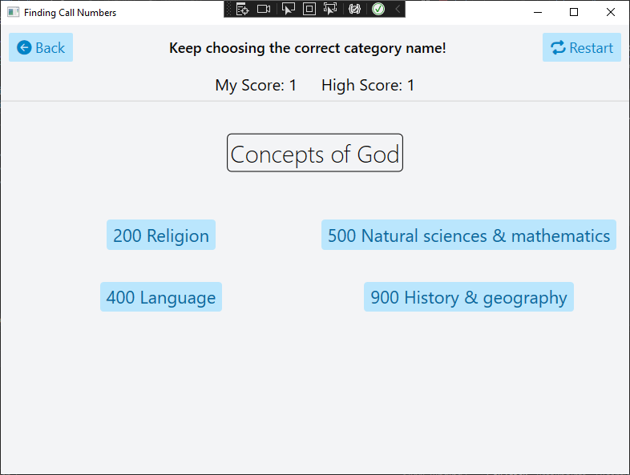

# PROG7312

This game shows you a call number and the user must guess which category it belongs to earn points.
This game can greatly aid the user in learning te Dewey Decimal System.
As a gamification feature, I implemented high scores so the user can compete with themselves.

## Libraries Used
- `Newtonsoft.Json` for loading and parsing the JSON tree of call numbers.
- `Font Awesome 6 Free Solid` for icons.
- `Inter` font for the display.